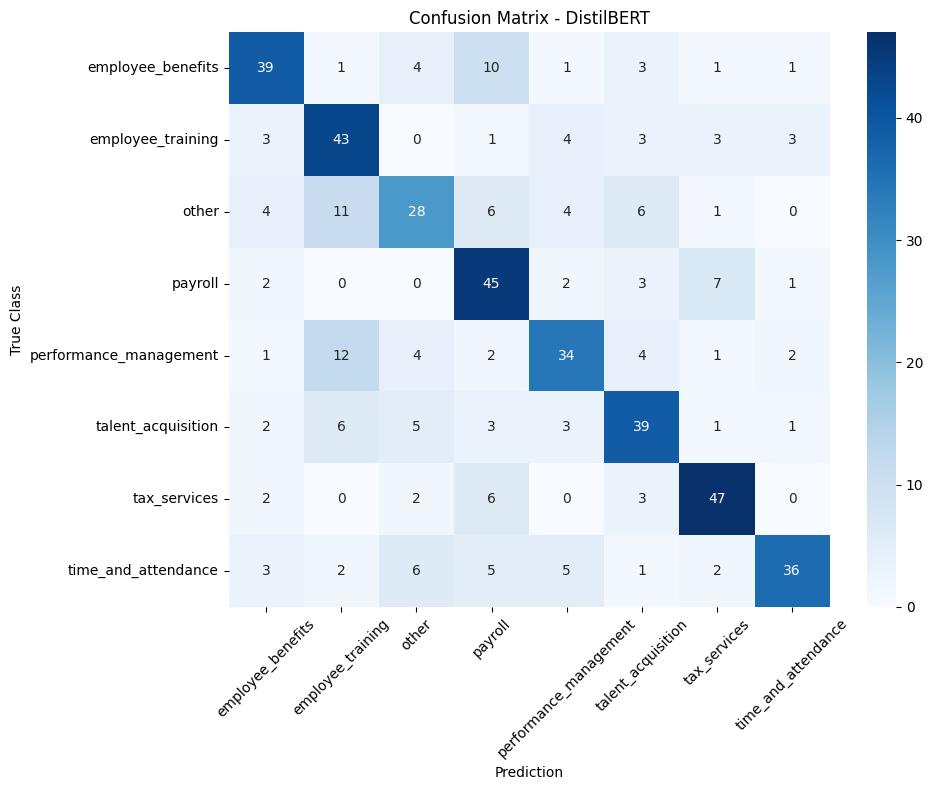
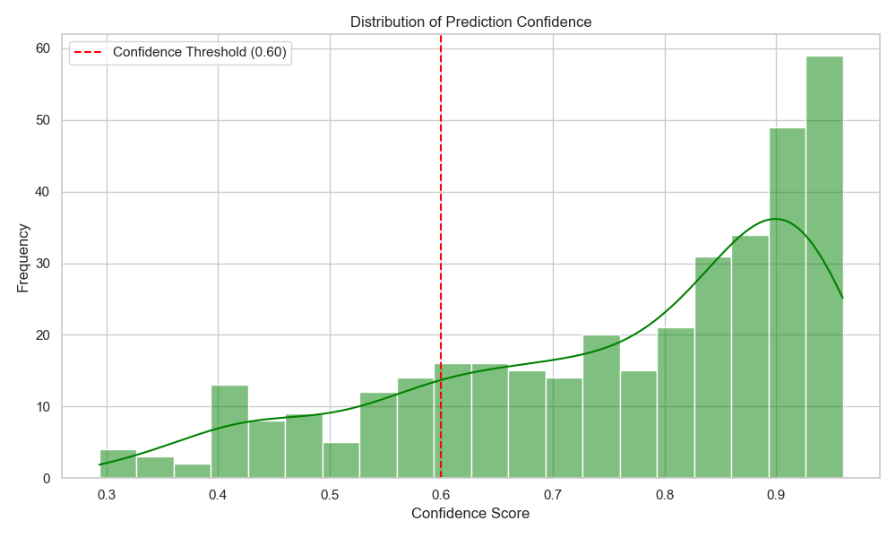
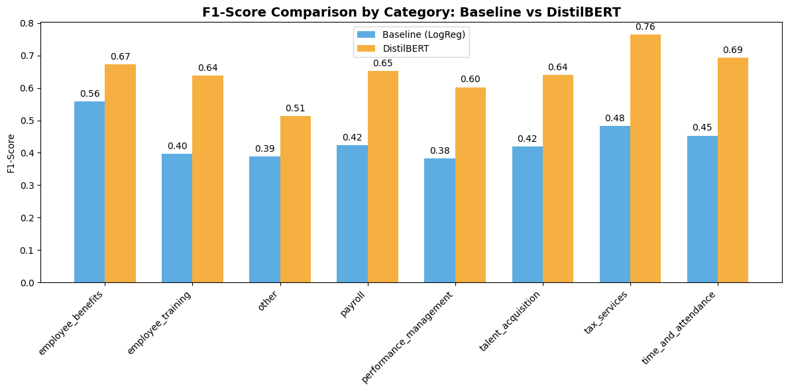
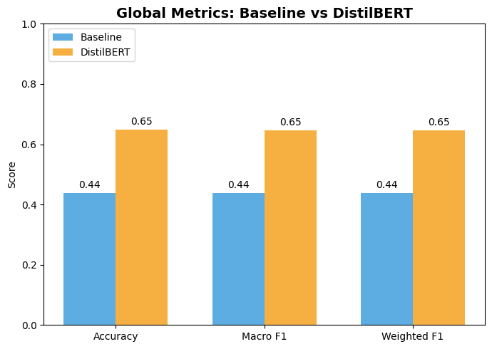

# ADP Data Science Take-Home Assignment

**Candidate:** Abraham

---

## 1. Project Objective

The main objective of this project is to develop a Natural Language Processing (NLP) model capable of categorizing user messages into 8 predefined Human Resources topics. This model will serve as the routing engine for a customer support chatbot, ensuring each query is directed to the correct specialized human agent.

## 2. Assumptions

To meet the established product requirements, the following design decisions and assumptions were made:

1. **Mutually Exclusive Classification:** Given the requirement that *"a message shouldn't be routed to more than one agent"*, the problem was strictly modeled as a multiclass classification task. The model outputs a single winning label per message.
2. **"Unsupported Operation" Logic:** It is assumed that out-of-domain messages are not explicitly labeled in the training dataset. Therefore, a **Confidence Threshold** was implemented. If the model's maximum predicted probability is below $0.60$, the message is internally flagged as "Unsupported" rather than forcing an erroneous routing.
3. **Role of the 'Other' category (ID 2):** It is assumed that this topic serves as a catch-all for miscellaneous HR-related queries that belong within the company's scope, distinct from completely out-of-domain messages rejected by the probability threshold.

## 3. Description of the Approach

To ensure a robust solution, two iterative approaches were developed and compared using Python, `scikit-learn`, and the Hugging Face `transformers` library, managed via **uv** for reproducible environments.

### Phase 1: Baseline Model (TF-IDF + Logistic Regression)

A quick baseline was established using a traditional statistical approach. Text was vectorized (limiting vocabulary to top 1000 words), and a multiclass linear model was trained.

* *Finding:* The model achieved an **Accuracy of 44%**. This evidenced that isolated keywords are insufficient for classifying these messages due to the high lexical similarity between categories like `payroll` and `tax_services`.

### Phase 2: Advanced Model (Fine-Tuning with DistilBERT)

To resolve semantic ambiguity, a Transformer-based model (`distilbert-base-uncased`) was implemented. This architecture processes the bidirectional context of sentences.

**Key Engineering Improvement: Physical Data Isolation**
To guarantee zero data leakage and full reproducibility:
1. A dedicated script (`prepare_data.py`) was implemented to split the original dataset into three physical files: `train.csv`, `val.csv`, and `test.csv` (70/15/15 split).
2. The training pipeline and evaluation notebooks were updated to consume these static files, ensuring the test set remains 100% "unseen" during all experimentation phases.

* **Training Strategy:** Training was configured for up to 10 epochs. To prevent overfitting and optimize learning, the following was implemented:
  * **Linear Learning Rate Scheduler:** The learning rate starts at 2e-5 and decreases linearly to ensure stable convergence.
  * **EarlyStopping:** Halts training if the model fails to improve its validation loss after 2 epochs, automatically restoring the best weights (`load_best_model_at_end`).

## 4. Evaluation and Results

Evaluation was performed on the physically isolated test set (`data/split/test.csv`).

As shown in the attached charts, the Transformer-based architecture consistently outperformed the linear model across all metrics, increasing the overall F1-Score from **0.44 to 0.64**.

* **Model Strengths:** DistilBERT was highly accurate in identifying `tax_services` (F1-Score: 0.74) and `employee_benefits` (F1-Score: 0.68). It successfully understood the intent behind complex messages without being confused by shared corporate jargon.
* **Areas of Opportunity:** The `other` category showed the lowest performance (F1-Score: 0.58). Lacking a defined linguistic pattern, it is natural for the model to have lower confidence here, aligning with the catch-all nature of the label.
* **Edge Case Handling:** The probability distribution analysis (Softmax) demonstrated that the model generates a clear confidence margin, allowing the threshold ($< 0.60$) to act as an effective filter for flagging unsupported topics.

## 5. Metrics

**Analysis:**

* **High accuracy in key topics:** The main diagonal is strongly highlighted, emphasizing the model's ability to correctly identify tax_services and payroll.
* **Understanding misclassifications:** The numbers outside the diagonal indicate where the model gets confused. For example, the other category is often confused with employee_training or talent_acquisition. This is an expected behavior, as other is a miscellaneous category without a strictly defined vocabulary. There is also a slight confusion between employee_benefits and time_and_attendance, which makes sense since concepts like "Paid Time Off" (PTO) are frequently mentioned in both contexts.

**Analysis:**

* **High overall certainty:** The large clustering of data on the right side (between 0.8 and 1.0) demonstrates that when the model makes a decision, it is generally very confident due to its deep contextual understanding.
* **Justification for the "Unsupported" filter:** The left "tail" of the distribution represents ambiguous or out-of-domain messages. Every prediction falling to the left of the red line ($< 0.60$) is successfully captured by our safety logic and flagged as an "Unsupported operation". This visually proves that the threshold filter is necessary to prevent the chatbot from routing incorrect responses.

**Analysis**

* **Transformer superiority:** DistilBERT consistently outperforms the Logistic Regression model in every single category.
* **Critical performance improvements:** The model proved its true value in complex topics. For instance, in tax_services, it jumped from 0.48 to an impressive 0.76. In payroll, it went from 0.42 to 0.65. This proves that while the Baseline was easily confused by isolated financial keywords, DistilBERT successfully grasped the semantic difference between concepts like "paying taxes" and "receiving a salary".

**Analysis**

* **Business impact:** Transitioning from a linear model to a Deep Learning architecture generated an absolute increase of 21 percentage points (from 0.44 to 0.65) across all global metrics.
* **Robustness:** The fact that the Macro F1 and Weighted F1 scores are identical to the Accuracy (0.65) indicates that the model is not biased toward a single majority class. Instead, it maintains a balanced, reliable, and stable performance across the entire routing system.

## 6. Conclusion

The Fine-Tuning approach with DistilBERT fully satisfies ADP's business requirements. It provides singular message routing based on deep semantic understanding and incorporates a probabilistic safety layer to filter unsupported operations, offering a solid foundation for chatbot integration.
